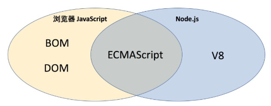
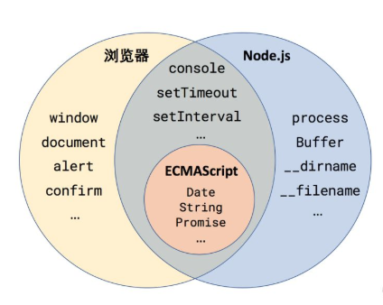

[TOC]

## 什么是 Node？

简单地说，Node是 JavaScript 的一种**运行环境**。在此之前，我们知道 JavaScript 都是在浏览器中执行的，用于给网页添加各种动态效果，那么可以说**浏览器也是 JavaScript 的运行环境**。那么这两个运行环境有哪些差异呢？请看下图：



两个运行环境共同包含了 ECMAScript，也就是剥离了所有运行环境的 JavaScript **语言标准**本身。现在 ECMAScript 的发展速度非常惊人，几乎能够做到每年发展一个版本。

><span style="color: red; font-weight: bold;">提示</span>
ECMAScript 和 JavaScript 的关系是，前者是后者的规格，后者是前者的一种实现。
在日常场合，这两个词是可以互换的。更多背景知识可参考阮一峰的[《JavaScript语言的历史》](https://javascript.ruanyifeng.com/introduction/history.html#toc3)。

另一方面，浏览器端 JavaScript 还包括了：
* 浏览器对象模型（Browser Object Model，简称 BOM），也就是 **window**对象
* 文档对象模型（Document Object Model，简称 DOM），也就是 **document** 对象

而 Node.js 则是包括 V8 引擎。V8 是 Chrome 浏览器中的 JavaScript 引擎，经过多年的发展和优化，性能和安全性都已经达到了相当的高度。
而 Node.js 则进一步将 V8 引擎加工成可以在任何操作系统中运行 JavaScript 的平台。

## 运行 Node 代码

运行 Node 代码通常有两种方式：
* 在 REPL 中交互式输入和运行；
* 将代码写入 JS 文件，并用 Node 执行.

><span style="color: red; font-weight: bold;">提示</span>
REPL 的全称是 Read Eval Print Loop（读取-执行-输出-循环），通常可以理解为**交互式解释器**，你可以输入任何表达式或语句，然后就会立刻执行并返回结果。如果你用过 Python 的 REPL 一定会觉得很熟悉。

### 使用 REPL 快速体验
如果你已经安装好了 Node，那么运行以下命令就可以输出 Node.js 的版本：

```js
$ node -v
v12.10.0
```

然后，我们还可以进入 Node REPL（直接输入 `node`），然后输入任何合法的 JavaScript 表达式或语句：

```js
$ node
Type ".help" for more information.
> 1 + 2
3
> var x = 10;
undefined
> x + 20
30
> console.log('Hello World');
Hello World
undefined
```

有些行的开头是 `>`，代表输入提示符，因此 > 后面的都是我们要输入的命令，其他行则是表达式的返回值或标准输出（Standard Output，stdout）。运行的效果如下：

### 编写 Node 脚本
REPL 通常用来进行一些代码的试验。在搭建具体应用时，更多的还是创建 Node 文件。我们先创建一个最简单的 Node.js 脚本文件，叫做 timer.js，代码如下：

```js
console.log('Hello World!');
```

然后用 Node 解释器执行这个文件：

```js
$ node timer.js
Hello World!
```

看上去非常平淡无奇，但是这一行代码却凝聚了 Node.js 团队背后的心血。我们来对比一下，在浏览器和 Node 环境中执行这行代码有什么区别：

* 在浏览器运行 console.log 调用了 BOM，实际上执行的是 window.console.log('Hello World!')
* Node 首先在所处的操作系统中创建一个新的进程，然后向标准输出打印了指定的字符串， 实际上执行的是 process.stdout.write('Hello World!\n')

简而言之，Node 为我们提供了一个无需依赖浏览器、能够直接与操作系统进行交互的 JavaScript 代码运行环境！

## Node 全局对象初探

如果你有过编写 JavaScript 的经验，那么你一定对全局对象不陌生。在浏览器中，我们有 `document` 和 `window` 等全局对象；而 Node 只包含 ECMAScript 和 V8，不包含 BOM 和 DOM，因此 Node 中不存在 document 和 window；取而代之，Node 专属的全局对象是 `process`。在这一节中，我们将初步探索一番 Node 全局对象。

### JavaScript 全局对象的分类

在此之前，我们先看一下 JavaScript 各个运行环境的全局对象的比较，如下图所示：



可以看到 JavaScript 全局对象可以分为四类：

1. 浏览器专属，例如 `window`、`alert` 等等；
2. Node 专属，例如 `process`、`Buffer`、`__dirname`、`__filename` 等等；
3. 浏览器和 Node 共有，但是实现方式不同，例如 `console`（第一节中已提到）、`setTimeout`、`setInterval` 等；
4. 浏览器和 Node 共有，并且属于<span style="font-weight: bold; color: red;"> ECMAScript 语言定义</span>的一部分，例如 `Date`、`String`、`Promise` 等；


