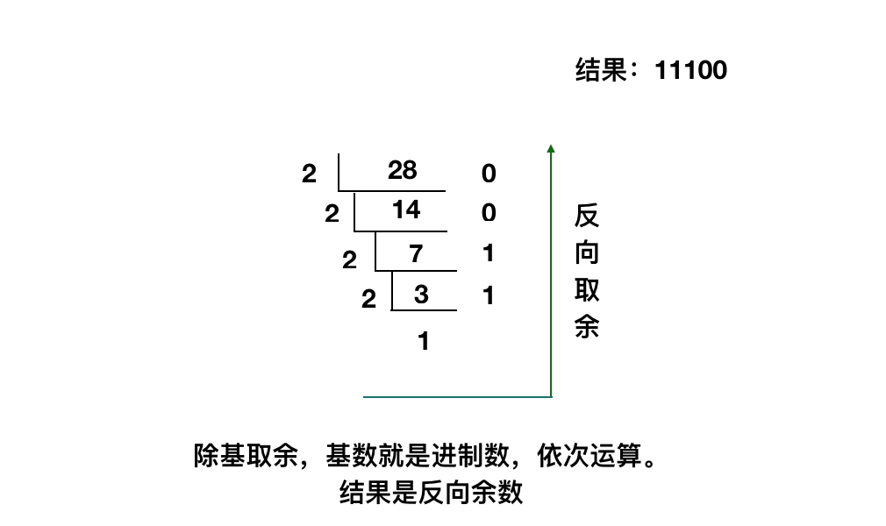
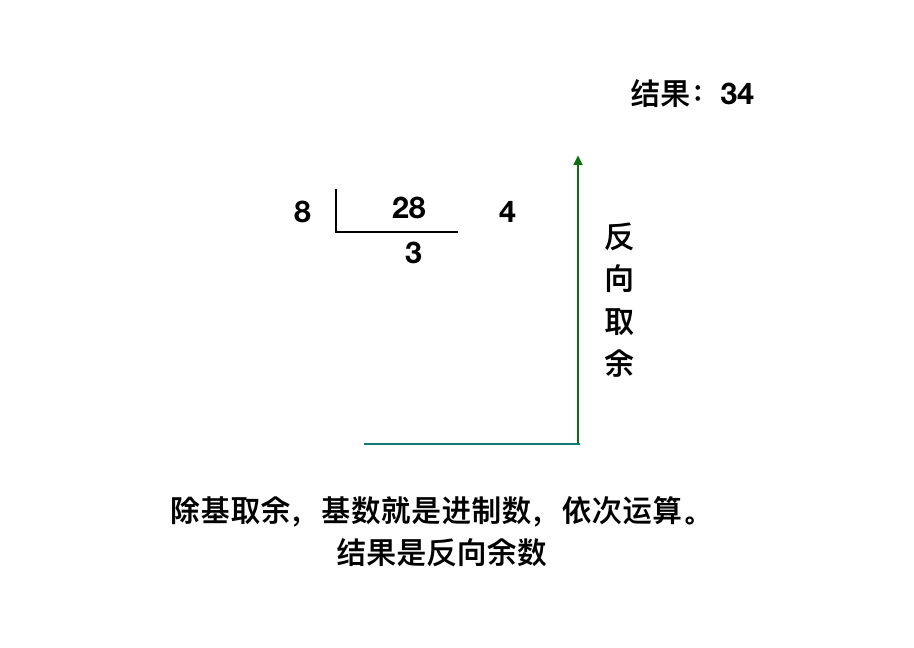
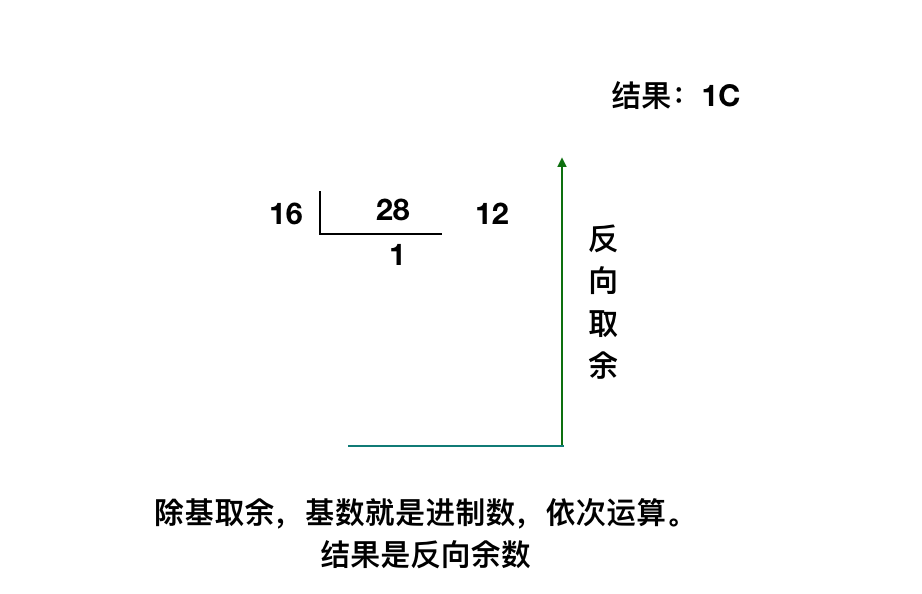
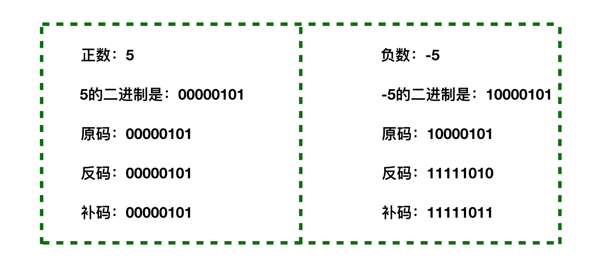

[TOC]

## 计算机进制转换：二进制、八进制、十进制、十六进制

#### 一、什么是进制

>
    在生活中，我们通常都是使用阿拉伯数字计数的，也就是10进制，以10为单位，遇10进一，所以是由0，1，2、3、4、5、6、7、8、9这个10个数字组成的；
    而在计算机中，计算机是无法识别10进制数的，它只能识别0和1，也就是二进制，由0、1两位数字组成，其运算规则是逢二进一。
    
    那么什么是进制呢，进制就是进位制，是人们规定的一种数字进位方法；对于任何一种进制（X进制），都表示某一位置上的数运算时是逢X进一位，
    如：二进制就是逢二进一，八进制就是逢八进一， 十进制是逢十进一，十六进制是逢十六进一，以此类推。
    
    由此可以得出，X进制就有X个组成元素，运算规则就是逢X进一；各进制都在计算机运算中承担着不同的角色。

<!--
    example：

    十进制：
    
    0    1    2    3    4    5    6   7    8    9    10........99    100
    
    9之后继续加 1 是10，就要进一，当前位数补 0；就是10.
    99之后继续加 1，个位是10，就要进一，当前位数补0；十位加上进的一之后也是10，再进一，当前位数补0；就是100。

    十进制数对应的其他进制为：
    十进制：  0    1     2     3      4      5      6      7       8       9      10      11      12      13      14      15       16

    二进制：  0    1    10    11    100    101    110    111    1000    1001    1010    1011    1100    1101    1110    1111    10000
    八进制：  0    1     2     3      4      5      6      7      10      11      12      13      14      15      16      17       20
    十六进制：0    1     2     3      4      5      6      7       8       9       A       B       C       D       E       F       10 

    ------------------------------------------------------------------------------------------------------------------------------

    十进制：      17      18    19    20      21     22    23      24    25     26     27      28      29      30      31       32

    二进制：  10001  10010  10011  10100  10101  10110  10111  11000  11001  11010  11011   11100   11101   11110   11111   100000
    八进制：     21     22     23     24    25      26     27     30     31     32     33      34      35      36      37       40
    十六进制：   11     12     13     14    15      16     17     18     19     1A     1B      1C      1D      1E      1F       20


    二/八/十六进制规律和十进制一样，如果加一大于当前进制（ 二/八/十六），就要进一，当前位数补0。
-->

#### 二、二进制、八进制、十进制、十六进制简介

>
    二进制：由0，1组成，运算规律是逢二进一，计算机只能识别二进制表示的数据；

    八进制：由0、1、2、3、4、5、6、7组成，运算规律是逢八进一；

    十进制：由0，1，2、3、4、5、6、7、8、9组成，运算规律是逢十进一；

    十六进制：由数字0～9以及字母A，B，C，D，E，F组成，运算规律是逢十六进一；

    在高级编程语言中，都提供了对各个进制数的支持，也提供了各个进制之间的转换方法和函数。


#### 三、进制转换


```html
以十进制数28为例，实现各进制数的转换
```

##### 1. 十进制和二进制之间相互转换

```html
十进制--->二进制：

对于整数部分，用被除数反复除以2，除第一次外，每次除以2均取前一次商的整数部分作被除数并依次记下每次的余数。

另外，所得到的商的最后一位余数是所求二进制数的最高位。
```



```html
二进制-->十进制：

进制数第1位的权值是2的0次方，第2位的权值是2的1次方，第2位的权值是2的2次方，依次计算，公式：第N位 * 2的N-1次方，结果再相加便是最后结果。

28的二进制是 11100，转换为十进制，过程如下：

1 * 2^4 + 1 * 2^3 + 1 * 2^2 + 0 * 2^1 + 0 * 2^0 = 16 + 8 + 4 + 0 + 0 + 0 = 28。
```

##### 2. 十进制和八进制之间转换

```html
十进制--->八进制：

10进制数转换成8进制的方法，和转换为2进制的方法类似，唯一变化：将图1中的基数由2变成8，然后依次计算。
```




```html
八进制--->十进制：

可参二进制的计算过程: 进制数第1位的权值为8的0次方，第2位权值为8的1次方，第3位权值为8的2次方，依次计算，公式：第N位 * 8的N-1次方，结果再相加便是最后结果。

28的八进制是 34，转换为十进制，过程如下：

3 * 8^1 + 4 * 8^0 = 24 + 4 = 28。
```

##### 3. 十进制和十六进制之间转换

```html
十进制--->十六进制：

10进制数转换成16进制的方法，和转换为2进制的方法类似，唯一变化：将图1中的基数由2变成16，然后依次计算。
```




```html
十六进制--->十进制：

第0位的权值为16的0次方，第1位的权值为16的1次方，第2位的权值为16的2次方，依次计算，公式：第N位 * 16的N-1次方，结果再相加便是最后结果。

28的十六进制是 1C，转换为十进制，过程如下：

1 * 16^1 + 12 * 16^0 = 16 + 12 = 28。
```

##### 4. 二进制和八进制之间转换

```html
可先转换为十进制，再转换为二进制或者八进制。
```

##### 5. 二进制和十六进制之间转换

```html
可先转换为十进制，再转换为二进制或者十六进制。
```

##### 6. 八进制和十六进制之间转换

```html
可先转换为十进制，再转换为十六进制或者八进制。
```

#### 四、二进制数字存储单位

>
    在计算机的数据存储系统中，数据存储的最小单位是位，位简记为bit，也称为比特；每个二进制数字0或1就是一个位(bit)，也就是一比特；也可以把二进制中的0和1看做开关中的“开”和“关”，1表示“开”，0表示“关”。另外，也可以把0和1的数据带到道家的阴阳八卦中去理解，0表示阴，1表示阳，0和1的转换就是阴阳的交替。

    8 bit（位）= 1B，也就是一个字节（Byte），然而1KB却不等于1000B，下面是详细的计算规则：

    1B（byte，字节）= 8 bit；

    1KB（Kibibyte，千字节）= 1024B = 2^10 B；

    1MB（Mebibyte，兆字节，百万字节，简称“兆”）= 1024KB = 2^20 B；

    1GB（Gigabyte，吉字节，十亿字节，又称“千兆”）= 1024MB = 2^30 B；

    1TB（Terabyte，万亿字节，太字节）= 1024GB = 2^40 B；

    1PB（Petabyte，千万亿字节，拍字节）= 1024TB = 2^50 B；

    以上这些是二进制数的存储单位计算规则，而在硬盘容量也能看到类似的单位，但是硬盘的容量通常是以十进制标识的，所以显示有500G容量的硬盘实际容量却不足500G。


#### 五、原码、反码和补码

>
    在计算机内，有符号数（这里的符号指的是正负符号，有符号数指的就是正负数）有3种表示法：原码、反码和补码，所有数据的运算都是采用补码进行的，也就是基于补码来做计算。

    在二进制中，二进制数的最左边为最高位，根据二进制定点表示法，二进制最高位为符号位，“0”表示正，“1”表示负，其余位表示数值的大小。也就是说二进制最左边的数决定了这个数是正数，还是负数，正数的符号位是0，负数的符号位是1。

    正数的原码，反码，补码都相同；

    负数的则有不同的计算规则，详情如下：

    原码：负数的原码和正数的原码差别就在最高位，正数的符号位是0，负数的符号位是1；

    反码：负数的反码是对其原码逐位取反（0变1，1变0），但符号位（最高位）除外，因为最高位（符号位）是不能被改变的；

    补码：负数的补码是在其反码的末位加1（逢二进一）；

    需要注意的是：求反码的时候，最高位（符号位）是不能被改变的， 正数的符号位是0，负数的符号位是1。

    然后通过一个例子来实践原码、反码和补码是如何计算出的；下面是案例详情：


